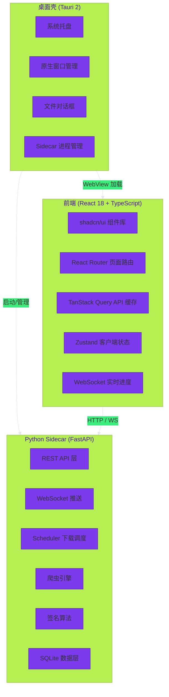

<div align="center">
  

  # VideoGetTool

  <p align="center">
    <strong>「让视频获取更简单」</strong>
  </p>

  <p align="center">
    <em>轻量优雅的抖音数据抓取桌面工具</em>
  </p>

  <p align="center">
    <a href="https://github.com/Cat-Drink/VideoGetTool/releases">
      
    </a>
    
    
    <a href="LICENSE">
      
    </a>
    
  </p>

  <p align="center">
    
    
    
  </p>

  <br>

  <!-- 导航标签 -->
  <p align="center">
    <a href="#✨-功能特性"><b>功能特性</b></a> ·
    <a href="#📸-界面预览"><b>界面预览</b></a> ·
    <a href="#🚀-快速上手"><b>快速上手</b></a> ·
    <a href="#🛠️-开发指南"><b>开发指南</b></a> ·
    <a href="#🧰-技术栈"><b>技术栈</b></a> ·
    <a href="#📁-项目结构"><b>项目结构</b></a> ·
    <a href="#❓-常见问题"><b>常见问题</b></a>
  </p>
</div>

<br>

> **VideoGetTool (VGT)** —— 名字取自 "Video Get Tool"（视频获取工具），寓意轻松获取网络上的精彩视频。
> 一款面向非技术用户的 Windows 桌面端应用，支持抖音（Douyin）与 B 站（Bilibili）短视频、图文、长视频的数据抓取与下载。
> 参考 [Evil0ctal/Douyin_TikTok_Download_API](https://github.com/Evil0ctal/Douyin_TikTok_Download_API) 的设计思路，但 **不直接复用其代码**，有效降低外部依赖风险。

---

<br>

## ✨ 功能特性

<div align="center">

| | | |
|:---:|:---:|:---:|
| 📹 **内容全覆盖** | ⚡ **智能下载引擎** | 🎨 **舒适体验** |
| 抖音 + B 站双平台<br>短视频 · 图文 · 长视频<br>单链接 · 批量 · 主页抓取 | 断点续传 · 并发下载<br>分块加速 · 自动重试<br>B 站 DASH 音视频合并 | 现代 Tauri 桌面界面<br>实时进度 · 元数据导出 |

</div>

<br>

<details open>
<summary><strong>📹 内容全覆盖</strong> — 支持多种抖音内容类型与抓取方式</summary>

<br>

| 能力 | 说明 |
|:---|:---|
| 🎬 **短视频下载** | 支持抖音 / B 站短视频下载，保留原始画质 |
| 🖼️ **图文下载** | 支持抖音图文作品的图片与描述一并保存 |
| 🎥 **长视频下载** | 支持超过 30 分钟的长视频资源下载 |
| 🔗 **批量链接** | 粘贴多条链接，批量解析并下载 |
| 👤 **用户主页** | 输入用户主页链接，批量抓取该用户所有作品 |
| 📺 **B 站 DASH 合并** | B 站高品质视频为音视频分离的 DASH 格式，下载后自动通过 ffmpeg 合并（需自行安装 ffmpeg，见[快速上手](#🚀-快速上手)） |
| 📃 **B 站分 P 选择** | 多 P 视频可逐 P 选择下载，灵活控制下载内容 |

</details>

<br>

<details open>
<summary><strong>⚡ 智能下载引擎</strong> — 可靠、高效、省心</summary>

<br>

| 能力 | 说明 |
|:---|:---|
| 🔄 **断点续传** | 意外中断后自动恢复，已下载部分不重复，节省时间与流量 |
| 📡 **并发下载** | 可调节并发数（1–10），根据网络情况自由控制带宽占用 |
| 🧩 **分块下载** | 大文件自动切分为多个分片并行下载，显著提升速度 |
| 🔁 **失败重试** | 下载失败自动重试（最多 3 次），临时网络波动无影响 |
| 🎞️ **DASH 合并** | B 站高质量视频自动下载音视频流并通过 ffmpeg 合并（需自行安装 ffmpeg） |

</details>

<br>

<details open>
<summary><strong>🎨 舒适用户体验</strong> — 让工具回归工具的本质</summary>

<br>

| 能力 | 说明 |
|:---|:---|
| 🖥️ **现代桌面界面** | 基于 Tauri + React 构建，原生窗口体验，流畅高效 |
| 🌙 **深色模式** | 支持浅色/深色主题一键切换，护眼舒适 |
| 📊 **实时进度反馈** | 下载进度、速度、状态一目了然，心中有数 |
| 📝 **元数据导出** | 支持 **JSON** / **CSV** 格式导出作品元数据 |
| 🧭 **首次引导** | 首次启动引导配置 Cookie 与下载目录，零门槛上手 |
| 🎯 **系统托盘** | 最小化到托盘，后台持续下载，不干扰工作 |

</details>

<br>

---

<br>

## 📸 界面预览

> <em>界面截图正在路上，以下为布局预览 — 实际界面以最新 Release 为准。</em>
>
> 测试套件已从 599 项扩展至 **734 项**（新增 49 项 B 站爬虫测试 + 23 项 B 站 API 测试 + 63 项其他测试），覆盖 B 站 WBI 签名、链接解析、DASH 下载、后端 API 等模块。

<br>

| 页面 | 功能 | 入口 |
|:---|:---|:---:|
| 📥 **下载任务** | 查看下载队列，进度、暂停、恢复、重试 | 导航栏第 1 项 |
| 🔗 **批量抓取** | 粘贴抖音链接，批量解析作品信息并加入下载 | 导航栏第 2 项 |
| 👤 **主页抓取** | 输入用户主页链接，批量抓取作品 | 导航栏第 3 项 |
| 🍪 **Cookie 配置** | 添加 / 测试 / 管理 Cookie，查看详细教程 | 导航栏第 4 项 |
| 📺 **B 站抓取** | 粘贴 B 站视频链接，解析多 P 信息并下载 | 导航栏第 5 项 |
| ⚙️ **设置** | 下载目录、并发数、分块大小、元数据格式 | 导航栏第 6 项 |

<br>

---

<br>

## 🚀 快速上手

### 📦 下载安装

从 [GitHub Releases](https://github.com/Cat-Drink/VideoGetTool/releases) 页面下载最新版安装包：

```text
VideoGetTool_0.3.0_x64-setup.exe
```

运行安装包，按向导提示完成安装即可。

> **💡 需要自行安装 ffmpeg（仅下载 B 站视频时必需）**
>
> B 站的高清视频（720P 及以上）采用 DASH 格式，音视频流是分离的，下载后需要 **ffmpeg** 将它们合并成带声音的完整视频。VideoGetTool **不会自动捆绑或下载 ffmpeg**，需要你自行安装。抖音视频下载**不需要** ffmpeg。

<details>
<summary><strong>📋 点击查看 ffmpeg 安装方法（Windows）</strong></summary>

<br>

**方式一：winget 一键安装（推荐，最简单）**

打开 PowerShell 或 CMD，执行：

```powershell
winget install Gyan.FFmpeg
```

安装完成后**重新打开** VideoGetTool（或重启应用），即可自动识别。

**方式二：官网手动下载**

1. 打开 [gyan.dev 官方构建页](https://www.gyan.dev/ffmpeg/builds/)（或 [ffmpeg.org 下载页](https://ffmpeg.org/download.html)）
2. 下载 **ffmpeg-release-essentials.zip**（约 80MB）并解压
3. 将解压出的 `bin\ffmpeg.exe` 所在目录加入系统 **PATH** 环境变量（或把 `ffmpeg.exe` 复制到 VideoGetTool 的 `resources\ffmpeg\` 目录）
4. 重新打开 VideoGetTool

**验证是否安装成功**

```powershell
ffmpeg -version
```

能输出版本信息即表示安装成功。

> ⚠️ 如果未安装 ffmpeg，B 站 DASH 视频的下载任务会以"合并失败"结束，**不会**生成可播放的成品文件。请先安装 ffmpeg 再下载 B 站高清视频。

</details>

### 🍪 配置 Cookie

抖音和 B 站都需要登录态才能访问部分数据。首次启动时引导页会引导你完成配置。你也可以随时在 **Cookie 配置页** 操作：

<details>
<summary><strong>📋 点击查看抖音 Cookie 获取步骤</strong></summary>

<br>

| 步骤 | 操作 |
|:---:|:---|
| **1** | 打开抖音官网 [douyin.com](https://www.douyin.com) 并登录你的账号 |
| **2** | 按 <kbd>F12</kbd> 打开开发者工具，切换到 **Network**（网络）标签 |
| **3** | 刷新页面，点击任意网络请求 |
| **4** | 在请求的 **Request Headers** 中找到 `Cookie:` 字段，右键复制完整值 |
| **5** | 回到应用，在 **Cookie 配置页** 粘贴并点击「添加并测试」 |

</details>

<details>
<summary><strong>📋 点击查看 B 站 Cookie 获取步骤</strong></summary>

<br>

B 站 Cookie 通过 B 站抓取页面的「Cookie 测试」功能单独配置，无需在 Cookie 配置页添加。

| 步骤 | 操作 |
|:---:|:---|
| **1** | 打开 B 站官网 [bilibili.com](https://www.bilibili.com) 并登录你的账号 |
| **2** | 按 <kbd>F12</kbd> 打开开发者工具，切换到 **Network**（网络）标签 |
| **3** | 刷新页面，点击任意网络请求（如 `api.bilibili.com` 的请求） |
| **4** | 在请求的 **Request Headers** 中找到 `Cookie:` 字段，右键复制完整值 |
| **5** | 回到应用，在 **B 站抓取页** → **Cookie 设置** 粘贴并点击「测试 Cookie」 |

</details>

<br>

---

<br>

## 🛠️ 开发指南

### 📋 环境要求

| 项目 | 要求 |
|:---|:---|
| 🐍 **Python** | 3.11 或更高版本 |
| 🟢 **Node.js** | 18 或更高版本 |
| 🦀 **Rust** | 1.70 或更高版本 |
| 🪟 **操作系统** | Windows 10 / 11（x64） |

### 🔧 本地开发

#### 后端 (Python FastAPI)

```powershell
# 1. 创建并激活虚拟环境
python -m venv .venv
.\.venv\Scripts\Activate.ps1

# 2. 安装依赖
pip install -r requirements.txt

# 3. 启动后端服务
uvicorn backend.app:app --host 127.0.0.1 --port 18989 --reload
```

#### 前端 (Tauri + React)

```powershell
# 1. 进入前端目录
cd frontend

# 2. 安装依赖
npm install

# 3. 启动开发服务器（仅前端）
npm run dev

# 4. 启动 Tauri 桌面应用（前后端联动）
npm run tauri dev
```

### 🧪 运行测试

```powershell
# Python 后端测试（734 项，覆盖率 ≥ 80%）
pytest

# 仅运行 B 站模块测试
pytest tests/test_bilibili/ -v

# 前端 TypeScript 类型检查
cd frontend && npx tsc --noEmit
```

### 📦 打包构建

```powershell
# 1. 打包 Python sidecar（生成 binaries/backend-sidecar.exe）
pyinstaller --onefile --name backend-sidecar --distpath frontend/src-tauri/binaries --add-data "backend;backend" --add-data "app;app" --add-data "crawlers;crawlers" --add-data "downloader;downloader" --console sidecar_launcher.py

# 2. 构建 Tauri 安装包（生成 NSIS 安装包）
cd frontend
npm run tauri build -- --bundles nsis
```

### ✅ 代码质量

| 工具 | 用途 | 配置 |
|:---|:---|:---|
| [Ruff](https://github.com/astral-sh/ruff) | Python 代码检查 | `pyproject.toml` |
| [Black](https://github.com/psf/black) | Python 代码格式化 | `pyproject.toml`（行宽 100） |
| [TypeScript](https://www.typescriptlang.org/) | 前端类型检查 | `frontend/tsconfig.json` |
| [Pytest](https://github.com/pytest-dev/pytest) | Python 单元测试 + 集成测试 | `pyproject.toml`（覆盖率 ≥ 80%） |

<br>

---

<br>

## 🧰 技术栈

<div align="center">

| 层级 | 技术 | 版本 | 用途 |
|:---|:---|:---:|:---|
| 🖥️ **桌面壳** | Tauri 2 | 2.x | 原生窗口、托盘、系统集成 |
| 🎨 **前端框架** | React 19 + TypeScript | 19.x | 用户界面 |
| 💅 **样式系统** | Tailwind CSS 4 | 4.x | 原子化 CSS |
| 🧩 **UI 组件** | shadcn/ui | — | 可复用组件库 |
| 📡 **状态管理** | TanStack Query + Zustand | — | 服务端/客户端状态 |
| 🐍 **后端服务** | Python FastAPI (sidecar) | ≥ 3.11 | REST API + WebSocket |
| 🕷️ **爬虫引擎** | Python + httpx[http2] | — | 异步数据抓取与签名 |
| 🗄️ **数据存储** | SQLite（WAL 模式） | — | 任务 / Cookie / 配置持久化 |
| 📦 **打包分发** | Tauri (NSIS) + PyInstaller | — | 构建 Windows 安装包 |

</div>

<br>

### 🏗️ 架构分层



架构说明：

- **Tauri 桌面壳**：管理窗口、托盘、文件对话框，启动 Python sidecar 进程
- **React 前端**：运行在 Tauri WebView 中，通过 REST API + WebSocket 与后端通信
- **Python Sidecar**：独立的 FastAPI 进程，提供爬虫、下载、数据持久化能力
- **前后端分离**：前端只管 UI，后端只管业务逻辑，通过 HTTP/WS 协议解耦

<br>

---

<br>

## 📁 项目结构

```text
📦 VideoGetTool/
├── 📂 backend/               # FastAPI 后端服务
│   ├── 📄 app.py             # 入口与生命周期管理
│   ├── 📄 state.py           # 全局应用上下文
│   ├── 📂 api/               # REST API 路由
│   │   ├── 📄 health.py      # 健康检查
│   │   ├── 📄 download.py    # 下载接口
│   │   ├── 📄 crawler.py     # 爬虫接口
│   │   ├── 📄 cookie.py      # Cookie 接口
│   │   ├── 📄 config.py      # 配置接口
│   │   ├── 📄 bilibili.py    # B 站 API 接口（解析/播放流/主页/Cookie 测试）
│   │   └── 📄 ws.py          # WebSocket 实时推送
│   └── 📂 services/          # 业务服务层
│
├── 📂 frontend/              # Tauri + React 前端
│   ├── 📂 src/               # 前端源码
│   │   ├── 📂 components/    # UI 组件
│   │   │   ├── 📂 ui/        # shadcn/ui 基础组件
│   │   │   └── 📄 NavBar.tsx # 侧边导航栏
│   │   ├── 📂 pages/         # 功能页面
│   │   │   ├── 📄 DownloadPage.tsx
│   │   │   ├── 📄 BatchFetchPage.tsx
│   │   │   ├── 📄 ProfileFetchPage.tsx
│   │   │   ├── 📄 CookiePage.tsx
│   │   │   ├── 📄 BiliFetchPage.tsx  # B 站抓取页面
│   │   │   ├── 📄 SettingsPage.tsx
│   │   │   └── 📄 OnboardingPage.tsx
│   │   ├── 📂 store/         # Zustand 状态管理
│   │   ├── 📂 hooks/         # 自定义 Hooks
│   │   ├── 📂 lib/           # 工具函数与 API 封装
│   │   └── 📂 layouts/       # 布局组件
│   ├── 📂 src-tauri/         # Tauri Rust 后端
│   │   ├── 📂 src/
│   │   │   └── 📄 lib.rs     # 托盘、命令、sidecar 启动
│   │   ├── 📄 tauri.conf.json
│   │   └── 📄 Cargo.toml
│   └── 📄 package.json
│
├── 📂 app/                   # Python 数据层
│   ├── 📄 config.py          # 全局常量与路径
│   ├── 📄 database.py        # 数据库初始化
│   ├── 📄 models.py          # 数据模型
│   └── 📄 repositories.py    # 数据访问层
│
├── 📂 crawlers/              # 爬虫组件
│   ├── 📂 signer/            # 签名算法（抖音）
│   ├── 📂 bilibili/          # B 站爬虫模块
│   │   ├── 📄 bili_signer.py       # WBI 签名 + buvid3 生成
│   │   ├── 📄 bili_url_parser.py   # B 站链接解析
│   │   ├── 📄 bili_http_client.py  # B 站 HTTP 客户端
│   │   ├── 📄 bili_video_parser.py # B 站视频/播放流解析
│   │   ├── 📄 bili_user_crawler.py # B 站用户空间抓取
│   │   └── 📄 constants.py         # B 站 API 常量
│   ├── 📄 http_client.py
│   ├── 📄 url_parser.py
│   ├── 📄 video_parser.py
│   └── 📄 cookie_tester.py
│
├── 📂 downloader/            # 下载引擎
│   ├── 📄 scheduler.py
│   ├── 📄 downloader.py
│   └── 📄 progress_reporter.py
│
├── 📂 docs/                  # 设计文档与里程碑计划
├── 📂 tests/                 # Python 测试套件（734 项）
│   ├── 📂 test_bilibili/     # B 站模块测试（79 项）
│   │   ├── 📄 test_bilibili.py          # 爬虫单元测试（42 项）
│   │   ├── 📄 test_bili_downloader_dash.py  # DASH 下载测试（7 项）
│   │   └── 📄 test_bili_api.py          # 后端 API 测试（23 项）
├── 📄 sidecar_launcher.py    # PyInstaller 入口脚本
├── 📄 pyproject.toml
├── 📄 installer.iss          # (旧) Inno Setup 安装脚本
└── 📄 README.md              # 项目说明
```

<br>

---

<br>

## ❓ 常见问题

<details>
<summary><strong>为什么需要配置 Cookie？</strong></summary>

<br>

抖音和 B 站的数据接口都需要登录态才能访问。Cookie 中包含了你的登录凭证，应用需要用它来请求视频数据。Cookie 仅在你本机使用，**不会上传到任何第三方服务器**。

</details>

<details>
<summary><strong>B 站视频下载后为什么没有声音？</strong></summary>

<br>

B 站的高清视频（720P 及以上）采用 DASH 格式，音视频流是分离的。VideoGetTool 会检测到 DASH 流，需要调用 **ffmpeg** 将音视频合并。如果下载后没有声音（或下载失败提示"未找到 ffmpeg"），说明系统中尚未安装 ffmpeg 或应用未识别到它——请参照 [快速上手 → 下载安装](#📦-下载安装) 中的方法安装 ffmpeg 后重试。

</details>

<details>
<summary><strong>B 站 DASH 合并需要 ffmpeg 吗？</strong></summary>

<br>

是的，**必须自行安装**。B 站高品质视频（720P 及以上）的音视频流是分开的，需要用 ffmpeg 合并。VideoGetTool 不会捆绑 ffmpeg，会自动按以下顺序查找：配置路径 → 应用内置 `resources/ffmpeg/ffmpeg.exe` → 系统 PATH。

**如果找不到 ffmpeg**，B 站 DASH 视频的下载任务会以「DASH 合并失败：未找到 ffmpeg」结束，**不会**生成可播放的成品文件（仅抖音视频不受影响）。

安装方法见 [快速上手 → 下载安装 → ffmpeg 安装方法](#📦-下载安装)。

</details>

<details>
<summary><strong>如何获取 B 站 Cookie？</strong></summary>

<br>

在 B 站抓取页面的「Cookie 设置」区域，粘贴从浏览器开发者工具中复制的 Cookie 值，点击「测试 Cookie」即可验证有效性。B 站 Cookie 需要包含 `SESSDATA` 字段才能登录。详见上方的 [快速上手 → 配置 Cookie](#-配置-cookie)。

</details>

<details>
<summary><strong>如何安装 ffmpeg？</strong></summary>

<br>

Windows 下推荐使用 winget 一键安装：

```powershell
winget install Gyan.FFmpeg
```

安装后重新打开 VideoGetTool 即可自动识别。也可前往 [gyan.dev 官方构建页](https://www.gyan.dev/ffmpeg/builds/) 手动下载解压，并将 `bin` 目录加入系统 PATH。验证方法：在命令行执行 `ffmpeg -version`，能输出版本信息即安装成功。

</details>

<br>

<details>
<summary><strong>下载的视频保存在哪里？</strong></summary>

<br>

默认保存在 `%USERPROFILE%/Downloads/VideoGetTool/` 目录下。你可以在 **设置页** 中随时更改。

</details>

<br>

<details>
<summary><strong>下载中断了怎么办？</strong></summary>

<br>

不用担心！应用支持 **断点续传**。重新启动应用后，未完成的任务会自动进入下载队列，从断点处继续下载，已下载的部分不会重复。

</details>

<br>

<details>
<summary><strong>如何获取帮助或报告问题？</strong></summary>

<br>

欢迎在 [GitHub Issues](https://github.com/Cat-Drink/VideoGetTool/issues) 提交问题或建议。提问前请先搜索是否已有类似问题。

</details>

<br>

---

<br>

## 📄 许可证

<div align="center">

本项目基于 **Apache License 2.0** 开源。

<br>

[查看 LICENSE 文件](LICENSE) · [第三方归属与许可证说明](THIRD-PARTY-NOTICES.md) · [许可证迁移说明 (MIT → Apache 2.0)](docs/compliance/v0.3.0-license-migration.md)
[GitHub 仓库](https://github.com/Cat-Drink/VideoGetTool) ·
[提交 Issue](https://github.com/Cat-Drink/VideoGetTool/issues)

<br>

<sub>
  Copyright © 2026 VideoGetTool Contributors ·
  <a href="https://github.com/Cat-Drink/VideoGetTool/graphs/contributors">贡献者</a>
</sub>

</div>

<br>

---

<br>

<div align="center">
  <br>
  <sub>
    <strong>VideoGetTool</strong> — 用 ❤️ 构建 ·
    <em>视频获取，珍藏每一刻精彩</em>
  </sub>
  <br><br>
  <sub>
    <code>⭐ 如果这个项目对你有帮助，欢迎 Star 支持！</code>
  </sub>
  <br><br>
  <sub>
    <a href="#VideoGetTool">⬆️ 回到顶部</a>
  </sub>
</div>
